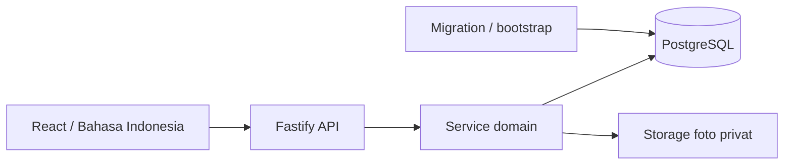
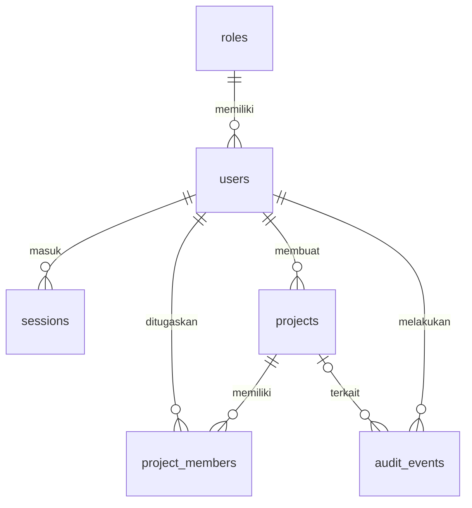

# Arsitektur SIMP — T00–T06

Diperbarui 30 September 2026 setelah implementasi pemeriksaan/koreksi laporan dan pemulihan migration. Tujuan: satu aplikasi prototype lokal dengan database nyata, batas frontend/backend yang jelas, dan jalur pengembangan hingga P3.

## Inventaris dan stack

Saat memulai T00, repository berisi PRD, dokumen rencana, bundle skill, dan `LAPORAN PROYEK contoh.xlsx`; belum ada aplikasi atau Git repository. Tidak ada `AGENTS.md` yang ditemukan pada workspace maupun direktori induk yang diperiksa. Tidak ada kode aplikasi lama yang ditimpa.

| Komponen | Pilihan yang dikunci | Alasan |
| --- | --- | --- |
| Runtime | Node.js 24.19.0 diuji; rentang 24.15–24.x | Runtime sudah tersedia; driver PostgreSQL asinkron |
| Package manager | npm 11.17.0 diuji | Satu `package-lock.json`, instalasi ulang dengan `npm ci` |
| Bahasa | TypeScript 5.9.3, strict | Dipilih eksplisit dalam seri 5; tidak berpindah major otomatis |
| Frontend | React/React DOM 19.3.0, Vite 8.3.1 | UI browser ringan dengan backend terpisah |
| Backend | Fastify 5.12.5 | API dan pengujian route lewat `inject` |
| Cookie / pembatasan login | @fastify/cookie 11.1.2, @fastify/rate-limit 11.2.0 | Cookie sesi dan pembatasan percobaan per IP |
| Berkas UI hasil build | @fastify/static 10.1.5 | Satu proses menyajikan UI/API pada demo hasil build |
| Validasi | Zod 4.6.5 dan schema route Fastify | Konfigurasi/masukan service serta kontrak API |
| Database | PostgreSQL 17.11, driver pg 8.23.0 | Persistensi lokal, FK, transaksi dan migration tanpa cloud |
| Tes | Node test runner, Playwright 1.63.0 | Unit/integrasi database nyata, proses server, dan browser |

Koneksi memakai pool PostgreSQL maksimal lima client per proses, timeout koneksi 5 detik, dan statement timeout 15 detik. Transaksi menggunakan satu client yang sama dari BEGIN sampai COMMIT/ROLLBACK, kemudian mengembalikannya ke pool. [Dokumentasi node-postgres](https://node-postgres.com/features/transactions).

Vite dipakai untuk dev/build frontend dan Fastify sebagai server aplikasi. Perintah serta pendekatan tes mengikuti dokumentasi resminya. [Vite](https://vite.dev/guide/), [Fastify testing](https://fastify.dev/docs/latest/Guides/Testing/).

## Struktur kode

```text
client/                   UI React, CSS, HTML Bahasa Indonesia
shared/contracts.ts       Tipe respons API yang aman dibagikan ke browser
shared/validation.ts      Validasi login/pengguna bersama di UI dan backend
server/
  app.ts                  Factory HTTP; bisa diuji tanpa membuka port
  index.ts                Startup, migration, shutdown dan lifecycle DB
  config.ts               Konfigurasi environment tervalidasi
  db/database.ts          Pool PostgreSQL dan transaksi asinkron
  db/migrate.ts           Migration berurutan dengan checksum
  db/migrations/postgresql/  Migration aktif untuk PostgreSQL
  db/migrations/001_...sql   Arsip SQL SQLite, tidak dijalankan
  services/               Bootstrap, autentikasi, dan pengelolaan pengguna
  routes/identity.ts      Endpoint sesi/pengguna, cookie dan validasi Origin
  security/password.ts    Hash dan pemeriksaan kata sandi
  security/authorization.ts Pemeriksaan sesi aktif dan role untuk modul berikutnya
  cli/                    Migration/bootstrap dari konfigurasi lokal
tests/                    Tes service/API/database
tests/browser/            Tes browser komputer dan HP
scripts/                  Penyalinan migration dan smoke test proses nyata
data/                     Cluster PostgreSQL/kredensial lokal dan arsip SQLite; diabaikan Git
storage/uploads/          Cadangan lokasi foto; diabaikan Git dan bukan static root
dist/                     Hasil build UI/server/migration
```



Modul foto T05 dan progress T07 sudah tersedia. Diagram menunjukkan batas modul; grafik dan ekspor menyusul pada tahap berikutnya.

## Runtime, routing, dan error

- Development: UI di 127.0.0.1:5173; proxy `/api` ke backend port 3001 atau nilai `PORT`. Browser tetap menggunakan origin frontend yang sama.
- Hasil build: Fastify menyajikan hanya `dist/client`; fallback HTML untuk route UI, error JSON 404 untuk route API/berkas yang tidak ada.
- `/api/health` memeriksa database melalui query schema, tanpa membocorkan path, pengguna, atau detail schema. DB gagal memberi 503; respons tidak di-cache.
- Error API memakai `{ error: { code, message, requestId, fields? } }`, pesan Indonesia dan validasi per isian. Detail error internal hanya pada log backend. Body permintaan tidak dicetak; header cookie/otorisasi disamarkan.
- Startup membuka DB, menerapkan migration, dan membuat direktori upload sebelum listen. Shutdown menutup koneksi. Tidak ada business endpoint tanpa auth yang ditambahkan pada T00.
- Halaman awal menjelaskan alur produk dan memeriksa koneksi aktual. Tidak mengisi daftar proyek/progress dengan data dummy.
- `/masuk` memuat login; `/pengguna` adalah pengelolaan akun Administrator; `/ringkasan` menampilkan identitas/role dan tautan proyek. `/proyek`, `/proyek/baru`, `/proyek/:id` menyediakan daftar, form bertahap, detail serta pengelolaan tim/status. Navigasi React sederhana menggunakan URL dan pemuatan halaman; API tetap menentukan hak akses.

## Database dan migration

`server/db/migrations/postgresql/001_identity_projects.sql` membuat `roles`, `users`, `projects`, `project_members`, dan `audit_events`. Migration `002_sessions.sql` menambahkan sesi persisten beserta indeks pengguna/kedaluwarsa. Runner memiliki tabel `schema_migrations` terpisah. Lima role adalah data referensi; database utama tidak diberi proyek atau akun demo otomatis.



Tabel memakai tipe PostgreSQL (DATE, TIMESTAMPTZ, BOOLEAN, BIGINT), foreign key, constraint nilai nonnegatif/tanggal/status, indeks unik lower(email), serta indeks penugasan/audit. `duration_days` dihasilkan dari tanggal inklusif. Field `updated_at`/`updated_by` akan diperbarui service ketika endpoint perubahan ditambahkan.

Nilai kontrak tetap memakai BIGINT sen (Rp1 = 100 sen), maksimum `Number.MAX_SAFE_INTEGER` sen. Driver mengembalikan BIGINT/NUMERIC sebagai string untuk menjaga presisi; service harus mengonversi secara eksplisit setelah validasi, bukan mengaktifkan parser Number global. DATE dipertahankan sebagai string tanggal bisnis, timestamp audit adalah TIMESTAMPTZ dengan sesi UTC. Volume/harga pekerjaan T03 memakai NUMERIC dan kalkulasi BigInt berskala di service, dengan rincian di bawah.

Migration PostgreSQL berjalan dalam transaksi dengan advisory lock per database/schema untuk mencegah dua startup menerapkan migration sama bersamaan. Nama dan SHA-256 SQL disimpan; perubahan/hilangnya migration lama ditolak. `.gitattributes` menjaga SQL berakhiran LF. Semua migration baru harus ditambahkan sebagai file baru; tidak ada reset/drop otomatis terhadap schema bisnis.

Transaksi menerima callback asinkron dengan PoolClient yang wajib dipakai untuk seluruh query transaksional. Hashing password dilakukan sebelum transaksi. Bootstrap memakai advisory lock per schema/email agar dua permintaan bersamaan hanya membuat satu akun dan satu audit. Persetujuan serta posting progress kelak menggunakan pola transaksi yang sama; pengujian beban production belum dilakukan.

## Autentikasi dan pengguna — T01

Kata sandi memakai scrypt asinkron dengan salt acak 16 byte, `N=65536`, `r=8`, `p=1`, hasil 64 byte; parameter dan salt disimpan bersama hash. Perbandingan hash memakai `timingSafeEqual`. Kata sandi baru 12–128 karakter; UI dan service memvalidasi masukan yang sama. [Node crypto](https://nodejs.org/download/release/v24.19.0/docs/api/crypto.html).

Sesi menggunakan token acak 32 byte, cookie `simp_session` HttpOnly, SameSite=Lax, Path=/, masa berlaku absolut 8 jam tanpa perpanjangan otomatis. PostgreSQL hanya menyimpan SHA-256 token. Login mengganti sesi dari cookie sebelumnya; logout menghapus sesi database dan cookie. Sesi kedaluwarsa ditolak pada setiap request dan dibersihkan saat login berikutnya. Sesi tetap tersedia sesudah backend restart. Pilihan ini mengikuti prinsip pengelolaan sesi server pada [OWASP Session Management](https://cheatsheetseries.owasp.org/cheatsheets/Session_Management_Cheat_Sheet.html).

Setiap request terlindungi membaca pengguna aktif dan role terkini dari database. Perubahan role, aktif/nonaktif, atau kata sandi mencabut **seluruh** sesi pengguna tersebut dalam transaksi yang sama; pengguna perlu masuk lagi. Mengaktifkan kembali akun tidak menghidupkan sesi lama. Perubahan nama/email saja mempertahankan sesi, dengan identitas baru pada request berikutnya. UI memeriksa ulang sesi saat halaman mendapat fokus, dan kembali ke login jika API bisnis menolak sesi.

Semua mutasi autentikasi/pengguna wajib membawa header Origin yang persis terdaftar pada `APP_ORIGINS`, termasuk login/logout; Origin kosong/asing ditolak. Default menerima localhost/127.0.0.1 port 5173/3001. Tidak ada wildcard atau CORS lintas origin. `COOKIE_SECURE=false` hanya untuk demo HTTP lokal; HTTPS memakai `true` dan daftar origin eksplisit. Validasi origin adalah perlindungan CSRF yang dipakai prototype bersama SameSite. [OWASP CSRF Prevention](https://cheatsheetseries.owasp.org/cheatsheets/Cross-Site_Request_Forgery_Prevention_Cheat_Sheet.html).

Login dibatasi 20 percobaan per menit per IP, dengan pesan 429 Indonesia. Pembatasan berada di memori satu proses dan kembali kosong saat restart. Email tidak ditemukan, password salah, dan akun nonaktif memakai respons 401 yang sama; email tidak ditemukan tetap melewati pemeriksaan hash dummy. Respons identitas/pengguna tidak memuat hash/token dan memakai Cache-Control: no-store. Integrasi plugin mengikuti [Fastify Cookie](https://github.com/fastify/fastify-cookie) dan [Fastify Rate Limit](https://github.com/fastify/fastify-rate-limit).

| Endpoint | Hak dan hasil |
| --- | --- |
| `POST /api/auth/login` | Kredensial tervalidasi; cookie dan identitas aman |
| `GET /api/auth/me` | Sesi aktif; identitas/role terbaru |
| `POST /api/auth/logout` | Mengakhiri sesi, idempoten, HTTP 204 |
| `GET /api/users` | Administrator aktif; daftar akun |
| `POST /api/users` | Administrator aktif; buat akun, HTTP 201 |
| `PATCH /api/users/:id` | Administrator aktif; ubah nama/email/role/status/password opsional |

Service pengguna memeriksa ulang hak Administrator di dalam transaksi, mengunci perubahan pengguna dengan advisory lock per schema, dan mencatat audit tanpa rahasia. Email unik tanpa membedakan kapital. Administrator aktif terakhir tidak boleh dinonaktifkan/diturunkan rolenya, termasuk dua perubahan serentak. Tidak ada penghapusan permanen akun; penonaktifan menjaga referensi dan audit. Direktori tim terbatas bagi Owner/TL tersedia bersama pembatasan proyek T02; mereka tetap tidak boleh membaca daftar akun global ini.

Bootstrap berjalan lokal dari environment, bukan endpoint publik. Pengulangan tidak mengubah nama/password/role akun existing; penggunaan email non-Admin atau nonaktif ditolak. Audit tidak menyimpan password/hash. Administrator tetap tidak diberi persetujuan teknis otomatis.

## Proyek dan tim — T02

Migration `003_project_management.sql` menambah metadata arsip proyek, jejak pembaruan anggota, dan indeks. Semua informasi PRD §8 menggunakan schema proyek awal, termasuk alamat instansi, kontrak awal/berjalan, jadwal dan durasi generated. `shared/projects.ts` menyediakan DTO/validasi serta format uang presisi; `server/services/projects.ts` menjadi service proyek/tim/status. Nilai rupiah dikirim sebagai string, dikonversi BigInt sen di backend, tanpa Number untuk nilai uang.

Route proyek terdaftar sebagai child plugin identity, sehingga cookie, validasi Origin dan no-store berlaku juga pada seluruh API proyek. Identitas selalu berasal dari sesi. Setiap service mengambil akun aktif melalui `projectActor(client, actorId)`, lalu memakai `requireProject(client, actor, projectId, write)` dalam transaksi yang sama. Role/status akun dikunci selama transaksi; mutasi proyek dan tim mengunci baris proyek, lalu memeriksa ulang penugasan setelah memperoleh lock. Modul berikutnya harus memakai pola ini dan menambah aturan modulnya sendiri; `write` pada guard proyek hanya memberikan hak pengelolaan Admin/TL, bukan hak persetujuan laporan teknis.

Admin melihat seluruh proyek. Role lain harus memiliki penugasan aktif dengan role yang sama seperti akun, dan `start_date <= hari_ini <= end_date`; end_date kosong berarti tanpa batas akhir. Hari ini berasal dari CURRENT_TIMESTAMP dalam timezone proyek, bukan tanggal mesin/browser. Timezone proyek diambil dari PROJECT_TIMEZONE saat dibuat dan tetap disimpan pada proyek. Pembuat TL diberi penugasan mulai hari itu agar jadwal proyek mendatang tidak menghalangi persiapan. Admin dapat mengganti TL melalui informasi proyek dan mengatur periode/status penugasannya. TL lama tidak dapat mengakses lewat penugasan yang sudah dinonaktifkan.

Semua role yang ditugaskan dapat melihat tim proyek; email anggota hanya diberikan untuk Admin/Owner/TL. Endpoint kandidat hanya boleh diakses pengelola proyek tersebut dan mengembalikan id/nama/role pengguna aktif yang diperlukan untuk penugasan (Admin: Owner/Engineer/Inspector; TL: Engineer/Inspector). Pilihan TL untuk form Admin memakai endpoint khusus. Tidak ada akses direktori akun global bagi Owner/TL.

Status otomatis dihitung setiap pembacaan DTO proyek. T09 memakai sumber progress T07: Selesai ketika seluruh volume item berbobot positif terpenuhi secara eksak; selain itu Terlambat bila hari proyek melewati akhir rencana efektif, Berjalan bila ada aktual atau tanggal mulai sudah tiba, dan Belum Dimulai sebelum itu. Tanpa rencana, jadwal kontrak dipakai. Koreksi `status_override` tetap mengungguli status otomatis, wajib beralasan dan diaudit. Kolom `projects.status` lama bukan sumber status dinamis; gunakan service/DTO proyek. Status Terlambat tidak ditentukan dari tanda deviasi.

DELETE proyek adalah arsip: metadata arsip dan audit dicatat atomik, relasi tidak dihapus, mutasi selanjutnya ditolak. Daftar default menyembunyikan arsip; `archived=true` menyertakannya tanpa melonggarkan hak proyek. Penugasan dihapus aksesnya melalui is_active=false, tetap tersimpan. Perubahan nama/kontrak/tanggal, status, tim dan arsip dicatat beserta pelaku/waktu serta sebelum/sesudah yang relevan.

| Endpoint | Hasil / hak |
| --- | --- |
| `GET /api/projects?q=&status=&archived=` | Daftar/pencarian berdasarkan nama/kode/kontrak/lokasi, saringan status; dibatasi penugasan |
| `POST /api/projects` | Admin/TL membuat proyek; TL menjadi penanggung jawab sendiri |
| `GET /api/projects/:id` | Detail proyek sesuai akses |
| `PATCH /api/projects/:id` | Admin/TL proyek mengubah informasi; hanya Admin mengganti TL |
| `PATCH /api/projects/:id/status` | Admin/TL proyek melakukan koreksi beralasan |
| `DELETE /api/projects/:id` | Admin/TL proyek mengarsipkan dengan confirm=true dan alasan |
| `GET /api/projects/:id/team` | Anggota proyek beserta periode/status efektif, termasuk riwayat nonaktif |
| `GET /api/projects/:id/candidates` | Kandidat aktif yang boleh ditugaskan oleh pengelola proyek |
| `POST /api/projects/:id/team` | Tambah penugasan Owner (Admin), Engineer/Inspector (Admin/TL) |
| `PATCH /api/projects/:id/team/:memberId` | Ubah periode/status; identitas penugasan tetap; periode TL hanya Admin |
| `GET /api/project-team-leaders` | Pilihan TL aktif untuk form proyek Administrator |

Pencarian/saringan daftar masih sederhana untuk volume prototype tanpa pagination; penyaringan teks/status dilakukan pada DTO yang sudah dibatasi hak akses oleh query database. Riwayat audit tersimpan di DB dan tampil melalui T09; pekerjaan, progress, baseline dan laporan tersedia pada tahap masing-masing.

## Pekerjaan bertingkat dan bobot — T03

Migration `004_work_items.sql` menambahkan work_items dan metadata penguncian basis pada projects. Work item memiliki identitas audit, kode unik per proyek, parent_id tunggal, jenis GROUP/ITEM, nama, uraian, satuan, volume, harga, jadwal opsional, status administratif dan keterangan. Foreign key `(parent_id, project_id)` menjaga induk dalam proyek yang sama; tidak ada cascade delete. Parent harus GROUP dan perubahan yang membentuk siklus ditolak service. Mutasi memakai lock proyek T02 dan validasi ulang seluruh rantai induk, termasuk saat dua perubahan terjadi bersamaan.

`server/services/work-calculation.ts::calculateWorkItems` adalah sumber tunggal nilai dan bobot. Volume maksimal 12 angka bulat + 6 desimal disimpan NUMERIC(18,6); harga maksimal 12 angka bulat + 2 desimal disimpan NUMERIC(14,2). Keduanya dikonversi ke BigInt skala 10^6 dan 10^2. Produk/penjumlahan memakai integer skala 10^8 tanpa pembulatan uang per baris. Nilai agregat kelompok menjumlah seluruh item turunannya; total proyek hanya menjumlah ITEM, termasuk yang berstatus nonaktif. Status tidak boleh menjadi jalan pintas untuk mengubah basis kontrak.

Bobot dihitung dari rasio nilai tepat terhadap total tepat. API mengembalikan `amount`/`totalAmount` sebagai string desimal tepat 8 digit, `weight` 6 desimal dan `displayWeight` 2 desimal. Kedua representasi bobot dibulatkan half-up langsung dari rasio asli, sehingga tidak terjadi pembulatan ganda. **Modul berikutnya harus memakai nilai tepat/rasio sumber dari kalkulator, bukan menjumlah bobot tampilan atau menggunakan weight 6 desimal sebagai basis baru.** Total bobot matematis 100% jika nilai positif; `displayedWeightTotal` hanya menjumlah bobot tampilan ITEM, dengan peringatan bila selisih >0,01 poin. Total nilai nol memberi bobot null dan penjelasan; volume nol tidak menjadi pembagi.

`server/services/work-items.ts` menyediakan CRUD, audit dan pembatasan proyek. Admin/TL proyek dapat menulis; Owner/Engineer/Inspector hanya membaca jika penugasannya aktif. Proyek arsip hanya-baca. Penghapusan memerlukan confirm=true, ditolak bila memiliki anak/referensi atau basis terkunci; data lama dicatat di audit. Tabel modul berikutnya wajib memakai FK RESTRICT untuk pekerjaan yang dirujuk, idealnya FK komposit bersama project_id.

`freezeWorkBasis(client, actorId, projectId, reason)` disiapkan untuk dipanggil **dalam transaksi yang sama** dengan penerbitan baseline T04. Hook hanya untuk TL proyek, memerlukan total nilai positif, idempoten dan mengikuti rollback pemanggil. Belum ada route/tombol untuk mengunci pada T03. Setelah terkunci, tambah/hapus serta perubahan kode/parent/jenis/satuan/volume/harga/jadwal ditolak; metadata nama/uraian/status/keterangan tetap dapat diubah dengan audit. Tidak ada unlock. Perubahan jadwal proyek biasa juga ditolak bila basis terkunci; jalur revisi terversi tetap harus dibangun di T04.

Tanggal pekerjaan boleh kosong; bila diisi, kedua batas valid dan berada pada rentang proyek. Sebelum basis terkunci, update proyek yang akan menempatkan pekerjaan di luar jadwal ditolak. Wadah kelompok tidak memaksakan tanggal anak di dalam tanggal kelompok; batas validasi jadwal pada T03 adalah rentang proyek.

| Endpoint | Hak dan hasil |
| --- | --- |
| `GET /api/projects/:id/work-items` | Struktur preorder, agregat, nilai/bobot, peringatan dan metadata penguncian; semua anggota yang berhak |
| `POST /api/projects/:id/work-items` | Admin/TL proyek membuat kelompok/item sebelum basis terkunci |
| `PATCH /api/projects/:id/work-items/:itemId` | Admin/TL proyek memperbarui data yang diizinkan, ID terikat proyek |
| `DELETE /api/projects/:id/work-items/:itemId` | Admin/TL proyek menghapus data yang belum dirujuk, tanpa cascade |

UI `/proyek/:id/pekerjaan` dapat dibuka dari detail proyek. Form dua langkah membedakan kelompok dan item; pilihan induk menyembunyikan diri/turunan, tetapi pemeriksaan backend tetap wajib. Semua nilai/bobot bisnis berasal dari respons kalkulator backend. Tampilan menyediakan keadaan kosong/memuat/gagal/berhasil, peringatan nilai nol/pembulatan, konfirmasi hapus, tampilan hanya-baca dan layout HP.

Pemeriksaan formula M1 workbook menunjukkan perkalian volume/harga dan pembagian nilai terhadap total yang sesuai PRD. Formula dengan referensi eksternal belum divalidasi ulang; workbook tetap pembanding template, bukan sumber data runtime.

## Periode dan rencana terversi — T04

`shared/plans.ts` menyediakan tanggal bisnis UTC tanpa konversi zona waktu, rentang minggu sesuai penanda versi rencana, rentang bulan kalender dari tanggal mulai asli dengan clamp akhir bulan, hari/minggu/bulan berjalan serta sisa hari. Versi lama memakai blok tujuh hari sejak awal proyek; versi baru memakai Senin–Minggu dengan periode pertama/terakhir parsial. Periode terakhir dipotong end_date inklusif. Hari ini untuk aturan publikasi berasal dari timezone proyek di PostgreSQL. Batas operasional prototype: 1–3.660 hari, 500 item, 20.000 nilai target per versi.

Migration `005_project_plans.sql` membuat `project_plan_versions` dan `project_plan_items`. Versi memiliki identitas baseline permanen, nomor unik, predecessor dalam proyek sama, tanggal berlaku unik, metadata publikasi, snapshot seluruh basis pekerjaan, rentang jadwal dan sumber periode. Item menyimpan satu array JSONB string persentase incremental sesuai urutan periode sumber; tanggal periode diturunkan deterministik dari snapshot jadwal. FK komposit menjaga referensi proyek; trigger menolak UPDATE/DELETE versi dan item terbit. Tidak ada draf persisten; editor menampung isian belum terbit di memori form.

`server/services/plans.ts` membaca versi, menentukan versi berlaku, menerbitkan dan mengaudit. Semua pembaca memakai guard proyek T02; publikasi hanya TL. Lock proyek menserialisasi publikasi dengan perubahan pekerjaan/tim. `previousVersionId` menolak editor versi lama dan retry ganda; hash `basisToken` mendeteksi perubahan daftar pekerjaan sejak editor dibuka. Target harus mencakup tepat seluruh ITEM sekali, setiap item tepat 100% (skala 10^6), tanpa target kelompok. Baseline memanggil `freezeWorkBasis` pada transaksi yang sama; kegagalan insert target membatalkan freeze, versi dan audit. Revisi memakai snapshot basis baseline, bukan metadata pekerjaan terkini.

Baseline berlaku sejak start proyek. Revisi wajib beralasan, tanggal berlaku > versi terakhir dan >= hari ini, dalam rentang jadwal versi. Pemilihan otomatis mengambil effective_date terbesar yang <= cutoff; tidak menyimpan flag aktif yang bisa tertinggal. Identitas baseline tetap ada setelah digantikan. Versi masa depan dapat dibaca tetapi belum berlaku. Tidak tersedia pembatalan versi terbit; perubahan berikutnya memerlukan versi baru.

Tanggal mulai tetap setelah baseline; tanggal selesai dan target dapat direvisi. **Kolom tanggal proyek tetap jadwal kontrak, sedangkan jadwal pelaksanaan efektif berasal dari versi pada cutoff.** Tidak ada pembaruan tanggal proyek ketika versi masa depan diterbitkan. Modul T05/T07 harus memilih jadwal versi sesuai tanggal kegiatan/cutoff, dan tetap menyimpan referensi sumber; jangan memakai tanggal kontrak untuk mengabaikan perpanjangan sah. Snapshot pekerjaan menyimpan tanggal awal sebagai metadata basis; target versi menentukan jadwal rencana yang direvisi. Status otomatis kini memakai progress sah dan jadwal rencana efektif melalui T09.

`server/services/plan-calculation.ts` adalah sumber angka rencana. Satu granularitas menjadi sumber; target suatu periode dibagi merata per hari. Agregasi ke periode lain menghitung overlap hari dengan pecahan BigInt yang disederhanakan, lalu mengalikan rasio nilai pekerjaan/total tepat dari kalkulator T03. Tidak membulatkan alokasi harian, bobot perantara atau menjumlah kumulatif. API menghasilkan target fisik, volume, tertimbang dan kumulatif enam desimal setelah agregasi; UI menampilkan persen dua desimal. Untuk agregasi/cutoff modul berikutnya gunakan kembali sumber rasional, bukan menjumlah keluaran enam desimal. Item nol nilai/volume tetap diberi target fisik 100%, namun kontribusi tertimbang/volume nol.

| Endpoint | Hak dan hasil |
| --- | --- |
| `GET /api/projects/:id/plans?cutoff=YYYY-MM-DD` | Histori lengkap, basis, hak publikasi dan identitas versi berlaku pada cutoff; default hari ini proyek |
| `POST /api/projects/:id/plans` | TL menerbitkan baseline/revisi beserta semua item atomik; versi baru memakai minggu Senin–Minggu |
| `GET /api/projects/:id/plans/workbook-targets` | TL melihat target TS yang cocok dengan basis pekerjaan, target versi sebelumnya, penanda berbeda/sama, dan aturan minggu sebelumnya sebelum mengisinya ke form |
| `GET /api/projects/:id/plans/:versionId/series?type=WEEKLY\|MONTHLY` | Angka periode proyek/per pekerjaan dari versi terpilih; ID versi harus dalam proyek |

UI `/proyek/:id/rencana` menyediakan editor tiga langkah, pembagian target rata eksplisit, validasi, riwayat/alasan/pembuat/waktu/daftar pekerjaan berubah, pilihan cutoff serta perbandingan dua versi. Grafik tersedia pada T09. Progress aktual tersedia pada T07; pengujian dengan laporan dan persetujuan nyata membuktikan revisi rencana mempertahankan aktual.

Workbook TS menempatkan target 38 item pada Minggu 1–22 dengan batas Senin–Minggu (16–19 Juli pada minggu pertama). Target TS diekstrak ke template dengan hash sumber dan dicocokkan terhadap kode, nama, satuan, volume, serta harga basis proyek sebelum dapat diterapkan. Migration `010_plan_week_convention.sql` memberi versi lama nilai `PROJECT_START`; versi baru disimpan sebagai `MONDAY_SUNDAY`. Item rencana tetap dirujuk memakai ID pekerjaan dan versi terbit tetap immutable. Bulan proyek tidak berubah. Perbedaan formula eksternal dan layout ekspor T10 tercatat pada docs/ekspor.md.

## Laporan harian dan foto — T05

Migration `006_daily_reports.sql` menambahkan daily_reports, activities, workforce, weather, materials, problems dan photos, serta counter nomor laporan per proyek. Laporan unik per proyek/tanggal/pembuat. Counter naik dalam lock proyek dan tidak digunakan ulang setelah draf dihapus. Nomor LH-00001 berada dalam lingkup proyek, bukan nomor global. Identitas proyek/kontrak dan plan_version_id disimpan pada laporan; hitungan periode berasal dari snapshot jadwal versi tersebut.

Aktivitas dan foto memakai kolom relasional serta FK komposit untuk menjaga proyek/laporan/kegiatan yang sama. Child workforce/weather/materials/problems masing-masing memakai tabel tersendiri, baris JSONB tervalidasi Zod dan posisi urutan. Struktur per orang/jenis/periode tetap utuh, bukan satu angka total atau JSON seluruh laporan. Simpan draf memperbarui aktivitas dengan ID stabil dan mengganti baris child lainnya dalam satu transaksi. Foto tidak terlepas saat edit biasa; tanggal atau kegiatan/pekerjaan terkait foto tidak dapat diganti sebelum foto dihapus.

`server/services/reports.ts` menjadi batas mutasi/read. requireProject menerima daftar role penulis eksplisit hanya pada pemanggilan modul laporan, sehingga Inspector dapat mengunci proyek untuk menulis laporan tanpa mendapat hak mengelola proyek. Default guard modul lain tetap Admin/TL. Hanya TL/Inspector pembuat dapat menulis draf; Inspector membaca milik sendiri, Admin/TL/Engineer membaca sesuai proyek, Owner hanya APPROVED. Aturan yang sama berlaku untuk daftar, detail, endpoint berkas serta dokumentasi pekerjaan. Penugasan/role/nonaktif/arsip diperiksa di backend. `editVersion` naik pada edit, upload, hapus foto dan kirim; konflik menolak pembaruan basi.

Tanggal kegiatan maksimal hari ini timezone proyek. Simpan memilih versi dengan effective_date terbesar <= report_date, lalu memvalidasi tanggal terhadap snapshot jadwal versi. Minimal satu uraian kegiatan wajib bahkan untuk draf. Volume nullable memisahkan naratif dari kuantitatif; yang kuantitatif wajib merujuk ITEM dalam basis dan satuannya ditentukan server. Jumlah volume per item dalam satu laporan diperiksa tepat memakai BigInt skala enam terhadap kontrak. T06 menambahkan batas kumulatif antar laporan saat kirim/persetujuan; perhitungan aktual tersedia pada T07. Kategori tenaga kerja mengikuti jenisnya, jumlah integer 0–10.000, jam 0–24 dua desimal. Cuaca opsional per waktu unik, malam dapat kosong; jam dalam satu tanggal. Material ditolak wajib alasan; material/masalah bertanggal sama dengan laporan.

T05 menyediakan DRAFT → SUBMITTED; T06 melengkapinya dengan permintaan perbaikan dan persetujuan sebagaimana dijelaskan di bawah. Ringkasan sebelum kirim berasal dari data tersimpan; kegiatan bervolume positif harus memiliki foto. Transaksi mengubah status, waktu kirim, editVersion dan audit; kirim ganda versi lama gagal tanpa audit ganda. Tes filter Owner kini menggunakan pengiriman dan persetujuan service aplikasi. Perhitungan progress tetap lingkup T07.

Foto dikirim melalui JSON base64 pada endpoint khusus dengan body limit 7 MiB. Batas file 5 MiB sebelum/sesudah normalisasi, 20 juta piksel dan 20 foto per laporan. Header/signature dan MIME harus cocok JPEG/PNG; Sharp 0.35.5 melakukan decode dengan `failOn: warning` dan batas piksel, lalu rotate/flatten/re-encode JPEG. Metadata bawaan tidak dipertahankan; hanya caption/lokasi/tanggal yang diisi pengguna dan pengunggah/waktu server disimpan. Pilihan decoder mengikuti [dokumentasi konstruktor Sharp](https://sharp.pixelplumbing.com/api-constructor/) dan [opsi output](https://sharp.pixelplumbing.com/api-output/).

Nama berkas berupa UUID server dengan ekstensi .jpg; tidak menerima path/nama berkas dari pengguna. UPLOAD_DIR diteruskan dari config → app → route. Berkas bukan static asset; GET memeriksa sesi/akses laporan lalu mengirim image/jpeg, no-store, nosniff dan CSP terbatas. Metadata foto tidak mengekspos path storage. Dokumentasi pekerjaan memfilter laporan sebelum mengambil foto, termasuk larangan draft bagi Owner.

Write file dilakukan dalam proses transaksi metadata; kegagalan transaksi membersihkan file yang baru ditulis. Penghapusan menghapus metadata secara transaksional lalu membersihkan file. Database dan filesystem bukan satu transaksi fisik: crash mendadak atau kegagalan unlink masih dapat meninggalkan berkas tanpa referensi; tidak ada rekonsiliasi otomatis pada prototype. Endpoint tidak dapat mengakses berkas tanpa metadata sah. Backup/pemulihan harus mencakup DB dan upload, dan kebutuhan cleanup/recovery production perlu dikerjakan terpisah.

| Endpoint di bawah `/api/projects/:id` | Hak dan fungsi |
| --- | --- |
| `GET/POST /reports` | Daftar sesuai role; TL/Inspector membuat draf sendiri |
| `GET/PATCH/DELETE /reports/:reportId` | Baca sesuai scope; ubah DRAFT/NEEDS_REVISION milik pembuat; hapus hanya DRAFT versi pertama |
| `POST /reports/:reportId/submit` | Pembuat mengirim setelah validasi foto; laporan terkunci |
| `POST /reports/:reportId/photos` | Pembuat mengunggah ke DRAFT/NEEDS_REVISION dengan editVersion |
| `DELETE /reports/:reportId/photos/:photoId` | Pembuat menghapus foto DRAFT/NEEDS_REVISION dengan editVersion |
| `GET /reports/:reportId/photos/:photoId/file` | Berkas privat mengikuti hak baca laporan |
| `GET /work-items/:workItemId/photos` | Dokumentasi pekerjaan, mengikuti filter laporan |

UI `/proyek/:id/laporan[/reportId]` berisi form empat bagian, detail, upload, review dan pengiriman. `/proyek/:id/dokumentasi/:workItemId` menampilkan foto terkait pekerjaan. Daftar/galeri belum memakai pagination; maksimal 100 baris setiap bagian child (cuaca maksimal empat) menjaga payload laporan. Tes foto memakai gambar sintetis, schema acak dan direktori sementara milik tes, tanpa data bisnis/unggahan pengguna.

## Pemeriksaan dan koreksi T06

Migration `007_report_reviews.sql` menambahkan `logical_id`, `revision`, `previous_report_id`, alasan koreksi, `report_reviews` serta `approved_report_sources`. Migration `008_approved_report_guards.sql` menambahkan perlindungan immutable pada header dan rincian laporan sah. Isi 007 tetap versi asli yang sudah diterapkan; tambahan schema wajib memakai migration baru. Data T05 menjadi versi 1 tanpa mengganti ID/nomor/foto. Identitas unik proyek/tanggal/pembuat berada pada versi pertama; seluruh koreksi menggunakan nomor dan tanggal aslinya. FK memastikan sumber menunjuk revisi dari proyek dan laporan logis yang sama. Hanya satu koreksi yang belum disetujui boleh ada.

`POST /api/projects/:id/reports/:reportId/reviews` menerima editVersion, kind dan note. Engineer menggunakan TECHNICAL_NOTE; TL menggunakan APPROVE atau REQUEST_CHANGES. Alasan perbaikan wajib. Status harus SUBMITTED dan versi harus cocok. Catatan, snapshot penuh sebelum keputusan, perubahan status/editVersion, audit dan pemilihan sumber resmi berada dalam satu transaksi. Semua mutasi memakai lock proyek, sama dengan perubahan penugasan. Retry/benturan mendapat 409 sehingga hanya satu keputusan tersimpan. Akun, role dan penugasan diperiksa kembali di backend.

NEEDS_REVISION membuka perubahan isian/foto untuk pembuat lalu kirim ulang. SUBMITTED tetap terkunci. APPROVED dilindungi guard aplikasi dan trigger PostgreSQL pada header/rincian. Laporan yang pernah diperiksa dan semua koreksi tidak dapat dihapus. Catatan teknis tidak menjadi prasyarat wajib persetujuan; TL boleh menyetujui laporan buatannya sendiri.

`POST /api/projects/:id/reports/:reportId/corrections` menerima editVersion dan reason. Pembuat dengan penugasan aktif menyalin versi sah terakhir menjadi draf turunan; semua kegiatan memperoleh ID baru, rincian disalin dan foto mendapatkan file/UUID sendiri. Versi lama tetap utuh. Rollback membersihkan salinan berkas yang sudah dibuat. Batas crash filesystem T05 masih berlaku. Pengalihan pembuat laporan yang tidak aktif belum didukung.

**Kontrak sumber T07:** join `daily_report_activities a` dengan `approved_report_sources s ON s.report_id=a.report_id`. Primary key logical_id membuat satu kontribusi resmi per laporan logis; jangan menjumlah seluruh laporan berstatus APPROVED karena versi arsip juga mempertahankan status tersebut. Persetujuan koreksi mengganti pointer ini secara atomik. Volume kumulatif divalidasi saat kirim dan persetujuan, mengecualikan kontribusi lama milik laporan logis yang sedang dikoreksi. Hitungan persen tersedia pada T07; rekap dan kurva tersedia pada T08/T09.

UI menyediakan filter Menunggu Pemeriksaan, catatan Engineer, keputusan TL, formulir alasan koreksi dan tautan versi. Owner menerima versi/foto APPROVED saja; metadata koreksi belum disetujui tidak muncul pada histori. Versi lama diberi label arsip setelah sumber berpindah. Galeri foto pekerjaan boleh menampilkan arsip disetujui; bukan sumber agregasi progress.

## Progress aktual T07

`GET /api/projects/:id/progress` memakai `projectProgress` di `server/services/progress.ts`. Query opsional: `from`, `cutoff`, `planVersionId`, `workItemId`. Tanggal inklusif; default cut-off adalah hari proyek dan awal periode mengikuti awal baseline. Filter pekerjaan membatasi rincian, sementara total tetap seluruh proyek. Versi rencana lintas proyek dan pekerjaan di luar basis ditolak. Lima role membaca sesuai penugasan; Administrator mengikuti akses administratif. Inspector melihat total proyek, tetapi rincian sumber hanya laporan miliknya.

Sumber tunggal adalah aktivitas kuantitatif pada `approved_report_sources`, dengan join proyek dan identitas logis yang cocok. Draf, laporan menunggu/perlu perbaikan, kegiatan naratif serta arsip yang sudah digantikan tidak menambah angka. Lock SHARE proyek dipertahankan selama pembacaan basis, rencana dan sumber; transaksi persetujuan/publikasi memakai lock UPDATE proyek yang sama. Pembaca memperoleh keadaan lengkap sebelum atau sesudah perubahan.

`progress-calculation.ts` menghitung volume, fisik, bobot sebelumnya/berjalan/kumulatif dan deviasi. Basis selalu snapshot Rencana Awal. Harga dan volume berskala serta pecahan BigInt dipakai sampai pembulatan hasil API enam desimal. Kelompok hanya menjumlah bobot anak; total hanya menjumlah daun. Pembagi nol menghasilkan null. `fractions.ts` dan alokasi harian `planTargetsBetween` dipakai bersama kalkulator rencana agar target tidak memiliki rumus terpisah.

Target memakai versi efektif pada cut-off, atau versi eksplisit untuk perbandingan. Pemilihan versi tidak memotong rentang aktual mengikuti akhir versi tersebut. Rincian sumber mencakup ID kegiatan/laporan/logis, revisi, tanggal kegiatan, waktu/pelaku persetujuan dan tautan laporan. `sourceVersion` menandai kumpulan sumber kuantitatif; bukan token keamanan ataupun pengganti audit T06.

Tidak ada migration baru, tabel progress manual, atau cache materialisasi. Persetujuan T06 sudah mengganti pointer kontribusi secara atomik. Pembacaan periode lama memakai sumber sah saat ini menurut tanggal kegiatan; bukan rekonstruksi keadaan persetujuan pada timestamp lama. Audit dan versi laporan mempertahankan alasan perubahan. T08–T10 harus memakai service ini untuk angka resmi, bukan menjumlah semua laporan APPROVED atau menghitung ulang di frontend.

## Storage dan rencana schema berikutnya

### Laporan berkala T08

`GET /api/projects/:id/period-reports?type=WEEKLY|MONTHLY&period=N&planVersionId=UUID` menghasilkan laporan web pada `/proyek/:id/laporan-berkala`. Default jenis mingguan dan periode yang memuat hari proyek (atau pertama/terakhir bila di luar jadwal). Nomor periode positif harus ada dalam daftar; versi rencana tetap diperiksa oleh service progress.

Awal periode mengikuti baseline/proyek; minggu mengikuti konvensi versi rencana yang dipilih. Tanpa pilihan versi eksplisit, rekap historis memakai versi efektif pada akhir periode yang diminta, sehingga minggu sebelum koreksi tetap mengikuti kalender lama. Bulan tetap dihitung dari tanggal mulai dengan clamp akhir bulan. Akhir daftar periode adalah akhir terjauh kontrak/seluruh rencana terbit, termasuk perpanjangan masa depan; periode terakhir dipotong pada tanggal itu. Pilihan versi rencana juga menentukan batas minggu saat membandingkan periode lama dan baru. UI menampilkan tanggal persis, jumlah hari inklusif, hari ke- dan sisa hari setelah periode. Periode belum selesai membandingkan aktual sah saat ini dengan target seluruh periode. Jadwal prototype dibatasi 3.660 hari sesuai modul rencana.

`periodReport` dan `progressInTransaction` berbagi satu transaksi/lock proyek. Fungsi kedua adalah inti service T07 yang juga dipanggil `projectProgress`; tidak ada rumus aktual baru pada T08. Metadata proyek/kontrak adalah nilai saat pembacaan, basis pekerjaan tetap snapshot baseline. Tidak ada snapshot rekap yang dapat diedit. Migration 001–008 tetap utuh, tanpa migration baru.

Rekap menyertakan identitas, volume/harga/nilai/bobot, partisi aktual/target, total dan deviasi. Status item ditentukan server dari volume kumulatif eksak (nol/belum, antara/sedang, sama kontrak/selesai); item tanpa volume dan kelompok diberi keterangan tersendiri. Rincian tenaga kerja/material/masalah ditampilkan per laporan/hari dari pointer sumber sah dalam periode, termasuk laporan naratif. Tidak menjumlah orang sebagai individu unik atau material lintas satuan. Rincian Inspector hanya miliknya, tetapi agregat progress tetap seluruh proyek sesuai kontrak T07.

Identitas pengesahan berasal dari review APPROVE setiap laporan sumber dan selalu disertai revisi/tanggal/tautan. Ini bukan tanda tangan digital, pengesahan tersendiri rekap, atau klaim bahwa TL saat ini menyetujui semua laporan lama. PDF/Excel tersedia pada T10; grafik tersedia pada T09. Layout workbook tidak diklaim identik (lihat docs/ekspor.md).

T05 menyediakan upload dan metadata DB. `UPLOAD_DIR` adalah lokasi privat; akses foto melewati endpoint dengan pemeriksaan hak proyek dan status laporan. Galeri proyek lintas laporan serta ekspor menyusul pada tahap pemiliknya.

| Tahap | Relasi/data yang ditambahkan atau dilengkapi |
| --- | --- |
| T01 (tersedia) | Sesi login, service pengguna dan role; audit perubahan |
| T02 (tersedia) | Endpoint/validasi proyek-tim, aturan status/override, periode/otorisasi dan arsip |
| T03 (tersedia) | Kelompok/item bertingkat, basis nilai/bobot, guard penguncian dan integritas referensi |
| T04 (tersedia) | Periode, versi terbit immutable, snapshot basis/jadwal, target, baseline dan tanggal berlaku |
| T05 (tersedia) | Draf/kirim laporan, child data lengkap, foto privat dan dokumentasi pekerjaan |
| T06 (tersedia) | Revisi laporan, pemeriksaan teknis, keputusan persetujuan dan pointer sumber resmi unik |
| T07 (tersedia) | Query kontribusi sumber/revisi sah, basis tetap dan agregat turunan; tanpa perubahan schema |
| T08 (tersedia) | Query rekap mingguan/bulanan dan rincian sumber; memakai service progress dan tanpa schema baru |
| T09 (tersedia) | Ringkasan role, kurva, galeri berfilter, riwayat audit dan status dari progress; tanpa schema baru |
| T10 | Metadata ekspor; tidak menambah database bisnis kedua |

## Monitoring T09

`GET /api/dashboard` memberi daftar proyek aktif yang dapat diakses, hitungan sesuai role, dan khusus Administrator jumlah pengguna serta 20 aktivitas sistem terakhir tanpa isi audit mentah. `/ringkasan` menampilkan pilihan proyek; detail proyek menautkan `/proyek/:id/ringkasan`. Inspector menerima hitungan laporan miliknya, Owner tidak menerima antrean draf/pending. Arsip tetap dapat dibaca melalui halaman proyek yang berhak.

`GET /api/projects/:id/monitoring` menerima `cutoff`, `type=WEEKLY|MONTHLY`, dan opsional `planVersionId`. Cut-off tidak boleh melewati hari proyek. Kartu memakai rencana efektif pada cut-off, sedangkan grafik default membandingkan baseline dengan versi terakhir terbit (termasuk rencana masa depan yang diberi penjelasan), atau versi pilihan pengguna. Jadwal grafik meliputi seluruh rencana terbit. Titik awal nol, akhir periode, dan cut-off yang jatuh di tengah periode dihasilkan server; aktual setelah cut-off bernilai null, bukan ramalan. Sumbu waktu proporsional tanggal; tabel angka tersedia selain SVG dan tooltip. Tidak ada pustaka grafik/dependensi baru.

`progressCurveInTransaction` memakai loader sumber resmi dan kalkulator T07 yang sama dengan ringkasan/laporan. Basis baseline tetap. Query membaca sumber sekali lalu menghitung setiap titik; bukan query database per titik. Proyek dikunci SHARE dalam transaksi monitoring sehingga persetujuan/perubahan rencana tidak mencampur snapshot. Antrean, catatan teknis dan riwayat adalah keadaan terkini; masalah dibatasi tanggal cut-off, menyembunyikan laporan tidak sah bagi Owner serta arsip yang telah diganti.

`GET /api/projects/:id/gallery` menerima `from`, `to` (tanggal pengambilan foto), `workItemId`, `reportId`, `uploadedBy`. Pemilihan proyek dilakukan lewat selector Ringkasan atau URL proyek. Filter digabung dengan pemeriksaan proyek/role di backend. Owner hanya foto laporan APPROVED, termasuk arsip; Inspector hanya foto laporan miliknya. URL berkas tetap memakai endpoint privat T05 yang memeriksa akses kembali. Galeri menampilkan kegiatan, tanggal, keterangan, pembuat unggahan dan tautan laporan/revisi.

`GET /api/projects/:id/history` membaca audit proyek dan menghasilkan DTO terbatas: pelaku, waktu, label tindakan, alasan/catatan yang diizinkan, versi dan sumber. JSON audit/snapshot/password/email tidak dikirim mentah. Owner hanya peristiwa persetujuan/koreksi laporan yang sudah APPROVED, bukan draf, perubahan draf, atau pending correction; Inspector hanya riwayat laporan miliknya. Riwayat proyek/pekerjaan/rencana mengikuti hak baca proyek. Status laporan pada riwayat diberi label keadaan saat ini, bukan status historis yang direkonstruksi.

Status proyek dihitung dari volume eksak pada service progress, bukan persen tampilan yang dibulatkan. Pembacaan daftar proyek dilakukan berurutan pada satu client transaksi PostgreSQL, menghindari query paralel pada client yang sama. Tidak ada migration, cache, pekerjaan latar, atau perubahan history migration pada T09. Riwayat/galeri belum dipaginasi dan belum diuji beban production.

## Perintah dan batas validasi

Lihat [README](../README.md) untuk setup dan perintah lengkap. `npm run build` mencakup typecheck; `npm test` menggunakan PostgreSQL nyata dengan schema acak terisolasi; `test:smoke` menjalankan CLI dan server lintas proses; `test:ui` memeriksa browser nyata. Tidak ada lint script yang diklaim berjalan karena linter belum dipilih. PostgreSQL lokal menjadi prasyarat; tidak diperlukan cloud atau Docker. `db:local:up` memanfaatkan binary PostgreSQL 17 yang sudah terpasang, menjalankan cluster khusus workspace pada 127.0.0.1:55432, dan membuat DATABASE_URL pada .env. Akun simp_app bukan superuser dan tidak punya CREATEDB/CREATEROLE; ia pemilik database development untuk menjalankan migration dan schema tes. Helper tidak menyentuh layanan PostgreSQL existing. `db:local:down` menghentikan hanya cluster workspace tanpa menghapus data.

Tes unit/integrasi, smoke, dan browser membuat schema simp_test_ dengan nama acak 32 karakter heksadesimal. Cleanup hanya menghapus schema yang dibuat helper, setelah validasi nama; search_path tidak memasukkan public sebagai fallback. Ini isolasi pengujian, bukan fitur multi-tenant. Aplikasi normal memakai schema public.

Workbook tersedia dengan lembar TS, M1–M5, B1, H0–H5. Formula nilai/bobot M1 diperiksa terbatas pada T03; periode dan perbandingan layout T10 didokumentasikan pada docs/ekspor.md; formula eksternal tidak dihitung ulang dari cache. Keberadaan workbook tidak mengubah prinsip database sebagai sumber data.

## Riwayat peralihan engine

SQLite adalah implementasi awal T00. Setelah pengguna memilih PostgreSQL, seluruh koneksi, service, migration aktif, dan tes dialihkan. Data SQLite diperiksa hanya-baca: users/projects/project_members/audit_events masing-masing nol, sehingga tidak diperlukan impor bisnis. File database serta SQL SQLite lama tetap utuh sebagai arsip, dengan jalur migration PostgreSQL terpisah. Tidak ada jalur runtime yang memakai node:sqlite.


## Ekspor T10

`server/services/exports.ts` membentuk DTO dari progress/rekap/laporan dalam satu transaksi dengan kunci baca proyek. Renderer `export-files.ts` hanya memformat DTO menjadi PDF/XLSX. Endpoint `/api/projects/:id/exports` memvalidasi jenis, periode dan format serta mengembalikan `no-store`. Web memakai `/proyek/:id/ekspor`. Foto dibaca dalam transaksi yang sama tanpa meminjam koneksi kedua. Tidak ada migration baru.

Filter daftar laporan diterapkan backend setelah cakupan role/proyek, dengan nomor minggu/bulan dari awal baseline dan akhir jadwal terjauh. Identitas pembuat yang ditawarkan hanya berasal dari laporan yang boleh dilihat. Rincian format, presisi, workbook dan dependency ada di [ekspor](ekspor.md).


### Template workbook (1 Oktober 2026)

Formulir utama ekspor memakai aset bersih `server/templates/workbook-layout.json`, dipetakan oleh `workbook-layout.ts`. `workbook-print.ts` membentuk SVG pratinjau dan pembagian halaman PDF dengan header berulang; XLSX memakai geometri/style yang sama. Formulir PDF diraster pada resolusi tinggi untuk menjaga susunan, dengan lampiran teks lengkap. Tidak ada formula workbook yang dieksekusi sebagai perhitungan runtime, perubahan schema, atau penyalinan data contoh. Lihat docs/ekspor.md untuk pemeliharaan template dan batas rendering.

### Nama kontraktor proyek

Perbaikan setelah T11 menambahkan `projects.contractor_name` melalui migration `009_project_contractor.sql`. Nilai kosong untuk proyek lama, maksimal 250 karakter; tersimpan lewat API proyek dan audit perubahan biasa. Kolom `contractorName` tampil pada tambah/ubah/detail proyek. Payload klien lama yang tidak mengirim kolom ini tidak menghapus nilai yang telah diisi saat update.

Laporan harian dan ekspor membaca identitas kontraktor proyek saat ini, dengan keterangan yang membedakannya dari snapshot kegiatan/volume/persetujuan. M1/B1 memakai kop U5 dan organisasi pelaksana U82, TS memakai Z72, H0 memakai identitas di B6. Nama penandatangan tetap tidak diisi otomatis. Migration 001–008 tidak diubah.

### Impor pekerjaan workbook untuk demo T11

Terpisah dari template tampilan, `scripts/extract-workbook-work.mjs` mengekstrak uraian/hierarki TS dan basis angka M1 menjadi `server/templates/workbook-work.json`. Pengguna membuka pratinjau lewat `GET /api/projects/:id/work-items/workbook`, lalu mengonfirmasi `POST` pada alamat sama. Service `workbook-work.ts` memvalidasi hak Admin/TL, keanggotaan/arsip, hash sumber, basis belum terkunci dan daftar kosong. Lock proyek serta satu transaksi menjaga 45 insert dan audit, termasuk klik bersamaan. UI tidak menjadi penyimpanan data; setelah impor seluruh fitur membaca tabel `work_items` biasa. Tidak ada migration atau impor target/aktual otomatis. Keputusan D90–D92 dan panduan demo menjelaskan presisi serta sumber.
